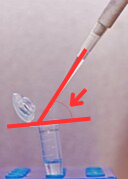

# Welcome to the transfyr.ai pipette angle challenge!

Your goal is to predict the relative angle between a pipette and a tube from the provided individual frames and videos. Below is a reference of the angle we are looking to predict.




# Input:

This repo provides 5 still images and 2 short video clips from Transfyr’s Observatory. The videos are each 2 seconds long at 30 fps with a resolution of 1920x1080. Your challenge is to write a software tool that estimates the angle between the pipette and the tube in each example. We (Transfyr) should be able to run your tool via the command line (and we will also assess it on a holdout set we haven’t shared).  

# Output:

Your tool should take a single-frame image as input, and provide output in CSV format:
```
Filename, angle
```

For the videos, your software should output a CSV with a separate row for each frame showing the angle in that frame with the following data:
```
Filename, frame, angle
```

Please include all appropriate dependencies to run your code, a README.md  that describes your approach, how you use AI in the assessment, and implement other coding best-practices as you see fit.

# Getting Started

Please clone this repo, and then create a new private repo within your GitHub user. Replace the remote of your local repo with the newly created private repo’s remote. Share that private repo with a few members of our technical team (GitHub usernames: @kathryn-transfyrai and @ari-transfyr).

Additionally, please record a short video 5-10min that walks through your solution and explains your thought process. Loom or similar services are a great way to record this video! If you have any questions, please don't hesitate to reach out to the Transfyr technical team. 

P.S. If you’re stumbling upon this repo and you haven’t had a screening call, shoot us an email at recruiting [at] transfyr.ai with your solution! You are awesome and we want to get to know you! 


